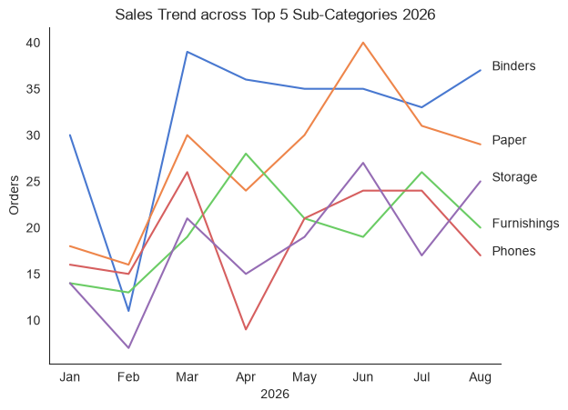
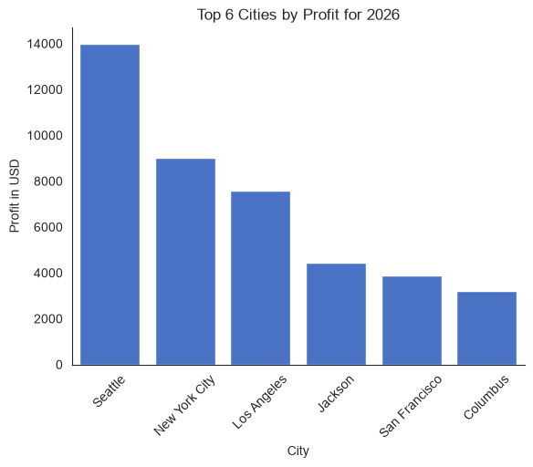
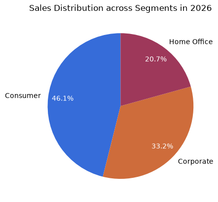
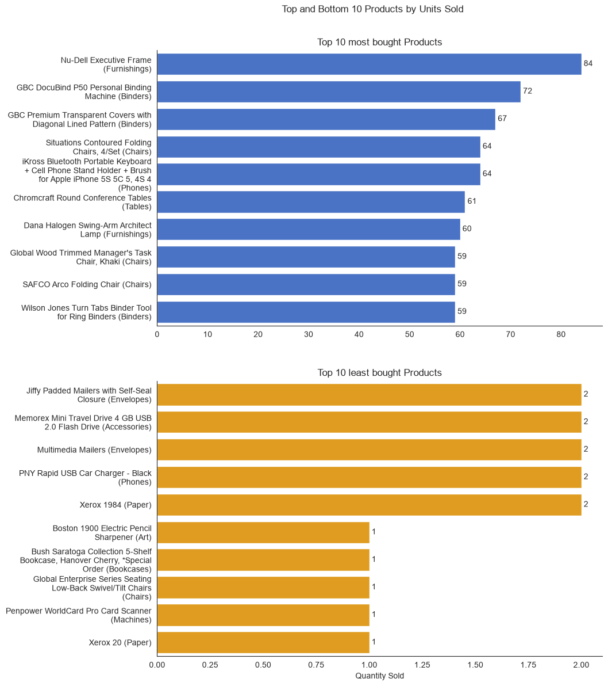

# Overview

# Questions

- Which product category is the most profitable? 
- How do sales trend over time? 
- Which states/regions/cities drive the most revenue?
- What's the sales distribution across customer segments (Consumer, Corporate, Home Office)? 
- Top 10 best-selling and worst-selling products

# Used Tools
- Python: the base of the analysis
- Used libraries:
  - Pandas Library: to analyze the data 
  - Matplotlib Library: to visualize the data 
  - Seaborn Library: to customize the visuals
- Jupyter Notebooks: to write and run the Python scripts
- PyCharm: to execute the Python scripts
- Git & GitHub: for version control and sharing the project

# The Analysis

## 1. Profitable Product Categories

To find the product category that is the most profitable, I grouped by the categories and aggregated the profit per category and sorted them by their total profit.

Details: [02_product_category.ipynb](02_product_category.ipynb)

### Results

  
*Bar graph visualizing the most profitable product category.*

### Insights

- Technology generates the most profit with over $25K and therefore is the most profitable category.
- Office Supplies is close second and also a profitable category.
- Furniture is significantly behind with under $5K. This could be due to low margins, high discounting or low sales volume and is worth a deeper analysis.

## 2. Sales Trend

For the sales trend, I filtered the data so that only entries for the past 8 months are remaining. Then I aggregated the amount of orders per Sub-Category and per month.

Details: [03_sales_trend.ipynb](03_sales_trend.ipynb)

### Results

  
*Line graph visualizing the sales trend of the top 6 Sub-Categories for 2026.*

### Insights

- Binders lead across most months and stay consistently high. 
- Paper hits the single highest point mid-year, when the supply needs to be restocked. 
- Phones have a sharp dip in April, this might be due to a stockout, a seasonal lull or missing data.
- Every Sub-Category dips in February and rebounds in March. This pattern suggests a seasonal or business-cycle effect.(e.g. restocking for the new year)
- All Sub-Categories are rising mid-year. This might be due to ordering semi-annual.
- Now in August, most Sub-Categories are reclining again.

## 3. Regional Revenue

To look for the Cities with the most profit, I only analyzed data concerning past January until now. Then I aggregated the Profit for each City and only used the top 6 Cities.

Details: [04_regional_revenue.ipynb](04_regional_revenue.ipynb)

### Results

  
*Bar graph visualizing the 6 Cities with the most Profit in 2026.*

### Insights

- For this year, Seattle is the leading market so far and generates a big portion of the profit.
- The first 3 Cities (Seattle, New York and Los Angeles) for an upper tier where the profits are all above \$7000. The last 3 Cities form the lower tier (Jackson, San Francisco and Clumbus) where the Profits are around $4000. This shows sights of the Cities who contribute a lot followed by a long tail.
- Remarking is that Jackson is a much smaller market than San Francisco, but it outperforms it. This is worth analyzing in more detail.

## 4. Distribution across Segments

To look at the Sales Distribution across the Segments, I aggregated the Sales for each segment.

Details: [05_distribution_segments.ipynb](05_distribution_segments.ipynb)

### Results

  
*Pie chart visualizing the Sales Distribution across the Segments in 2026.*

### Insights

- The Segment Consumer is the clear leader and takes up almost half of total Sales.
- Even thought Home Office is trending and growing, it has the smallest share. This might be due to a smaller addressable market or a lower average order value.
- All three segments contribute meaningfully to overall Sales.

## 5. Products

To find out, which products are sold the most and the least, I counted how many times the products were ordered.

Details: [06_products.ipynb](06_products.ipynb)

### Results

### Insights

- The top 3 best-selling products have significant gaps between them and after them sales flatten and leaves a long tail.
- Several binders are in the best-selling products, suggesting that these supplies are a core category and worth prioritizing. 
- Different furniture appears in both top-selling and least-selling products, which shows that performance varies widely in this category.
- The low numbers in quantity sold in the least-sold products show that there is practically no demand. These products are worth discontinuing.