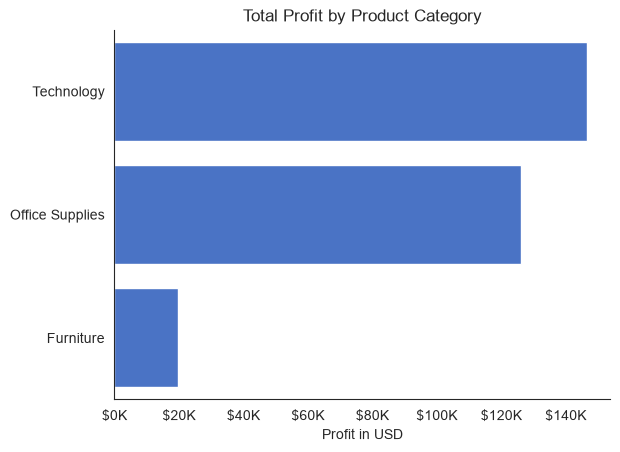

# Overview

# Questions

- Which product category is the most profitable? 
- How do sales trend over time? 
- Which states/regions/cities drive the most revenue?
- What's the sales distribution across customer segments (Consumer, Corporate, Home Office)? 
- Top 10 best-selling and worst-selling products

# Used Tools
- Python: the base of the analysis
- Used libraries:
  - Pandas Library: to analyze the data 
  - Matplotlib Library: to visualize the data 
  - Seaborn Library: to customize the visuals
- Jupyter Notebooks: to write and run the Python scripts
- PyCharm: to execute the Python scripts
- Git & GitHub: for version control and sharing the project

# The Analysis

## 1. Profitable Product Categories

To find the product category that is the most profitable,

Details: [02_product_category.ipynb](02_product_category.ipynb)

### Results

  
*Bar graph visualizing the most profitable product category.*

### Insights

- Technology generates the most profit with $150K and is the most profitable category.
- Office Supplies is close second with $130K and also a good category.
- Furniture is significantly behind with $20K. This could be due to low margins, high discounting or low sales volume and is worth a deeper analysis.

## 2. Sales Trend

### Results

### Insights

## 3. Regional Revenue

### Results

### Insights

## 4. Distribution across Segments

### Results

### Insights

## 5. Products

### Results

### Insights